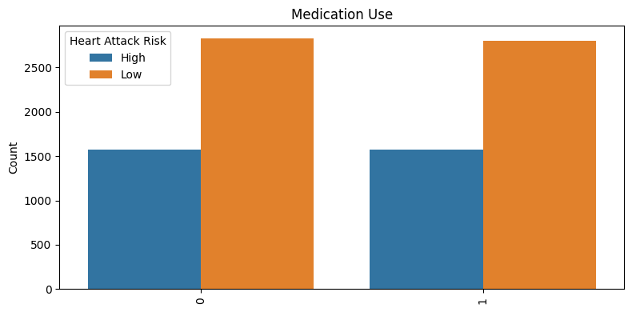
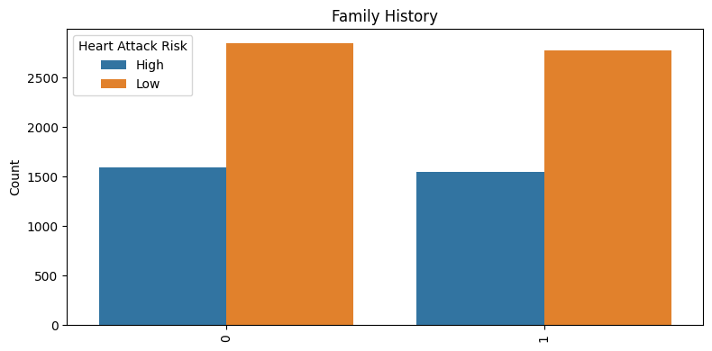

# Machine-Learning-Heart-Risk-Prediction-Model

A machine learning model designed to predict the risk of heart attacks based on various health metrics. The system analyzes factors such as age, blood pressure, cholesterol levels, and lifestyle habits to assess an individual's likelihood of experiencing a heart attack, providing valuable insights for early intervention and prevention

# Introduction

Heart attack, also known as a myocardial infarction, is a serious medical emergency that occurs when the flow of blood to a part of the heart is blocked for a long enough time that part of the heart muscle is damaged or dies. This blockage is most often caused by a buildup of fatty deposits called plaque inside the coronary arteries, which are the blood vessels that supply the heart with oxygen and nutrients.

Over time, plaque can accumulate in the coronary arteries, causing them to narrow and harden in a process called atherosclerosis. This narrows the space through which blood can flow, restricting the heart's supply of oxygen-rich blood. In many cases, a piece of the plaque can rupture, causing a blood clot to form on the surface of the plaque. This blood clot can then block the artery completely, cutting off the blood supply to part of the heart muscle.

When the heart muscle is deprived of oxygen for a prolonged period due to this blockage, the affected heart muscle begins to die. This is a heart attack. The longer the blockage persists, the more extensive the damage to the heart muscle becomes. Prompt treatment to restore blood flow, such as through the use of clot-dissolving medications or procedures to open the blocked artery, is critical to minimize permanent damage to the heart.

According to the World Health Organization (WHO), cardiovascular diseases, which include heart attacks, are the leading cause of death globally. Cardiovascular diseases are responsible for an estimated 17.9 million deaths each year, accounting for 31% of all global deaths. Heart attacks contribute significantly to this high mortality rate, underscoring the importance of prevention, early detection, and rapid treatment of this life-threatening condition.

# Objective

The objective of this project is to develop a reliable and accurate predictive model to support the early detection and prevention of heart attacks, ultimately contributing to improved cardiovascular health outcomes. The analysis process involves several key steps:

### Importing Libraries and Dataset

The first step is to import the necessary Python libraries, such as NumPy, Pandas, Matplotlib, and Scikit-learn, which will be used for data manipulation, visualization, and modeling.
The dataset containing the relevant features and the target variable (heart attack risk) will also be imported into the project.

### Data Cleaning

The dataset may contain missing values, outliers, or inconsistencies that need to be addressed.
The data cleaning process involves identifying and handling these issues, such as filling in missing values, removing outliers, and ensuring data integrity.

### Data Visualization

Exploratory data analysis is performed using various visualization techniques, such as scatter plots, histograms, and correlation matrices.
These visualizations help to understand the relationships between the features and the target variable, as well as identify any potential patterns or trends in the data.

### Feature Selection

Based on the insights gained from the data visualization, the most relevant features that are likely to influence the risk of a heart attack are selected.
Techniques like correlation analysis and feature importance, are used to identify the most informative features.

### Model Selection

After selecting the relevant features, various machine learning models are evaluated to determine the best-performing model for predicting heart attack risk.
Models used for this task include logistic regression, decision trees, random forests, and support vector machines.
The performance of these models is assessed using appropriate evaluation metrics, such as accuracy, precision, recall, and F1-score.

### Model Optimization

The selected model may be further optimized by tuning its hyperparameters, such as the regularization strength or the number of trees in a random forest.
This step aims to improve the model's performance and generalization capabilities.

### Model Evaluation and Deployment

The final model is evaluated on a held-out test set to assess its performance on unseen data.
Once the model is deemed satisfactory, it can be deployed to make predictions on new data and assist healthcare professionals in identifying individuals at high risk of heart attacks.

# Dataset Description

Source: [Kaggle DataSet](https://www.kaggle.com/datasets/iamsouravbanerjee/heart-attack-prediction-dataset)

The dataset is composed of 8763 observations. There are 24 independent variables and 1 dependent variable. Among 24 independent variables, there are 11 quantitative variables: age, cholesterol, blood pressure, heart rate, exercise hours per week, sedentary hours per day, income, BMI, triglyceride, physical activity days per week, sleep hours per day, and 13 categorical variables: sex, diabetes, family history, smoking, obesity, alcohol consumption, previous heart problems, medication use, country, continent, hemisphere, stress level, diet.

# Data Cleaning

The necessary libraries for data manipulation, visualization, and machine learning were imported. The dataset, 'heart_attack_prediction_dataset.csv', was read into a DataFrame using pandas.

Firstly, we check the data shape, null values, and duplicates in the dataset, and then drop the ‘Patient ID’ as it indicates nothing and does not contribute to the prediction. Secondly, we map and convert variables from numerical to categorical (0-Low, 1-High). Finally, we split the column ‘blood pressure’ into two variables, 'Systolic_BP' and 'Diastolic_BP' for more granular analysis and converted to integers.

# Data Visualization

## Distribution of Heart Attack Risk

The bar chart was used to display the distribution of heart risk count. As indicated above, Low indicates 0, which means no heart attack risk, while High indicates 1, which means heart attack risk.

## Distribution of Categorical Variables

Histograms for each categorical variable were plotted with respect to 'Heart Attack Risk' to observe their distribution.
Heart Attack Risk distribution by sex.

## Distribution of Numerical Variables

Box plots for each numerical variable were plotted with respect to 'Heart Attack Risk' to observe their distribution. We also split the column ‘blood pressure’ into ‘Systolic_BP’ and ‘Diastolic_BP’.

# Exploratory Data Analysis

##  Chi-Squared Test

The chi-squared test is a statistical test used to determine whether there is a significant relationship between two categorical variables. The test is performed to assess whether the categorical variables are significantly associated with the target or outcome variable.

The results show the chi-squared statistic (chi2) and the corresponding p-value (p-value) for each categorical variable. The p-value represents the probability of obtaining the observed test statistic (or a more extreme value) under the null hypothesis, which assumes that there is no significant relationship between the categorical variable and the target variable.

All the p-values are more than the commonly used significance level of 0.05 (or 5%). This indicates we fail to reject the null hypothesis, and there is little statistical significant relationship between these categorical variables and the target variable. The "dof" column represents the degrees of freedom for the chi-squared test, which is typically one less than the number of categories for each variable.

In summary, the results of the chi-squared test suggest that most of the categorical variables are insignificantly associated with the target variable. This information was useful for feature selection and futher analysis.

## Correlation 

A correlation matrix is a square matrix that shows the pairwise correlation coefficients between each pair of numerical variables in the dataset. The correlation coefficient ranges from -1 to 1, where -1 indicates a strong negative correlation, 0 indicates no correlation, and 1 indicates a strong positive correlation.

The correlation matrix provides a visual representation of the strength and direction of the relationships between these numerical variables. Each cell in the matrix represents the correlation coefficient between the corresponding variables.

The diagonal elements (where the row and column variables are the same) are all 1.0, as a variable is perfectly correlated with itself.
The color coding in the matrix helps to quickly identify the strength and direction of the correlations. The darker the red color, the stronger the positive correlation, while the lighter the yellow color, the stronger the negative correlation.

By analyzing the correlation matrix, the valuable insights into the relationships between the numerical variables in the dataset is that there exists no significant multi-correlations. This information was used to inform feature selection.

# Data Preprocessing

## Feature Engineering

The initial dataset contained a mix of categorical and numerical features. To prepare the data for modeling, One-Hot Encoding on the categorical variables was done. This involved creating binary indicator columns for each unique category, allowing the machine learning algorithms to better understand and leverage these features.

For example, the hemisphere column had two possible values: 'south' and 'north'. After one-hot encoding, this feature was transformed into two binary columns: south_hemisphere and north_hemisphere.

This encoding process ensured that the categorical variables were properly represented in a format that could be effectively utilized by the machine learning models.

# Model Selection

## Train-Test Split

After the feature engineering step, the dataset was split into training and testing sets, using an 80/20 ratio. This allowed the models to be evaluated on unseen data, ensuring that the results would generalize well to new, real-world instances.

The train-test split was performed before any data scaling, in order to avoid data leakage. By doing so, the standard scaler parameters (i.e., mean and standard deviation) were calculated solely based on the training data, and then applied to both the training and testing sets. This is a crucial step to prevent the model from gaining an unfair advantage during the evaluation process.

The rationale behind the 80/20 split is as follows:

Model Training: The training set, which comprises 80% of the data, is used to fit the machine learning models. This larger portion of the data allows the models to learn the underlying patterns and relationships within the dataset effectively.

Model Evaluation: The remaining 20% of the data is held out as the testing set. This unseen data is used to evaluate the performance of the trained models, providing an unbiased estimate of their generalization capabilities.

By separating the dataset into training and testing sets, the models' performance on new, unseen data can be assessed, which is a critical step in ensuring the models can be deployed in real-world scenarios with confidence. Overall, the train-test split was a crucial preprocessing step that allowed the machine learning models to be trained and evaluated in a robust and unbiased manner, laying the foundation for the subsequent model development and comparison.

## Data Scaling

Following the train-test split, the numerical features were scaled using the standard scaler. This step is essential for many machine learning algorithms, as it helps to ensure that the features are on a similar scale, which can improve the numerical stability and convergence of the models.

The standard scaler transforms the features by subtracting the mean and dividing by the standard deviation of each feature. This normalization process helps to prevent features with larger ranges from dominating the objective function during model training.

By scaling the data after the train-test split, the scaling parameters were calculated solely based on the training data, and then applied to both the training and testing sets. This is a crucial step to prevent data leakage and ensure an unbiased evaluation of the models.

## Resampling: Handling Class Imbalance

The dataset used for this heart risk prediction project exhibited a class imbalance, with a significantly higher proportion of participants without heart risk compared to those with heart risk. This imbalance can pose a challenge for many machine learning algorithms, as they may tend to favor the majority class and perform poorly on the minority class.

To address this issue, several strategies to balance the dataset and improve the model's performance on both classes were explored:

Unbalanced Data: In the first approach, the models were trained using the original, unbalanced dataset. This allowed a baseline performance for each algorithm without any specific handling of the class imbalance.

Balanced Data: Next, oversampling techniques to balance the dataset were used. Specifically, the Synthetic Minority Over-sampling Technique (SMOTE) to generate synthetic examples of the minority class (participants with heart disease). This resulted in a balanced dataset with an equal number of instances for both classes.

Training on Balanced, Testing on Unbalanced: In this approach, the models were trained on the balanced dataset created using SMOTE, but evaluated their performance on the original, unbalanced test set. This simulates a real-world scenario where the model would be deployed on unseen, potentially imbalanced data.

___
# Logistic Regression

Logistic Regression is a widely used supervised learning algorithm for binary classification problems. It models the probability of a binary outcome as a function of one or more predictor variables. In this case, logistic regression was implemented using the scikit-learn library to predict the presence or absence of heart disease risk. 

A grid search approach combined with cross-validation to optimize the hyperparameters of the logistic regression model was employed. Specifically, a grid of hyperparameters to search over was defined, including the regularization parameter C with values of 0.1, 1, and 10, and the regularization penalty penalty with options of 'l1' and 'l2'. Then a LogisticRegression model with the liblinear solver and set up a 5-fold cross-validation strategy using KFold was created.

The performance of the logistic regression model was evaluated on the full dataset, as well as on a dataset containing a selected set of variables. The choice of input features can significantly impact the model's performance. By evaluating the model on the full dataset and the dataset with selected variables, the goal was to assess the importance of feature selection and understand how the model's performance may be affected by the input features.
___
## Initial Dataset Before Feature Selection   

### Training and Testing on Unbalanced Data

 
 

### Training and Testing on Balanced Data

 
 

### Training on Balanced Data and Testing on Unbalanced Data

 
 

___
## Final Dataset After Feature selection

### Training and Testing on Unbalanced Data

 
 

### Training and Testing on Balanced Data

 
 

### Training on Balanced Data and Testing on Unbalanced Data

 
 

___
# Support Vector Machines

Support vector machines (SVMs) are a popular supervised learning algorithm used for classification and regression tasks. SVMs work by finding the hyperplane that best separates the data into distinct classes, while maximizing the margin between the hyperplane and the nearest data points. This makes SVMs well-suited for a variety of complex, high-dimensional classification problems.

A SVM model to classify the presence or absence of heart disease risk was using the scikit-learn library, specifying a radial basis function (RBF) kernel and tuning the hyperparameters gamma and C. A grid search over a range of gamma values (0.01, 0.1, 1) and C values (1, 10, 100) combined with 5-fold cross-validation was performed to optimize the hyperparameters. This allowed selection of the best-performing model.

Once the grid search was complete, the best-performing SVM model were retrieved and evaluated its performance on both the training and test sets. This provided insights into the model's generalization capabilities and its ability to make accurate predictions on unseen data.

___
## Initial Dataset Before Feature Selection   

### Training and Testing on Unbalanced Data

 
 

### Training and Testing on Balanced Data

 
 

### Training on Balanced Data and Testing on Unbalanced Data

 
 

___
## Final Dataset After Feature selection

### Training and Testing on Unbalanced Data

 
 

### Training and Testing on Balanced Data

 
 

### Training on Balanced Data and Testing on Unbalanced Data

 
 

___
# Decision Trees 

Decision trees algorithm are used for both classification and regression tasks. Decision trees work by recursively partitioning the feature space into smaller regions, and then making predictions based on the majority class or the average target value within each region.

In this study, ecision trees for heart disease risk classification was employed. A NumPy array of maximum depth values to search over,  was created, ranging from 1 to 14 with a step of 1. This allowed systematic investigation of the impact of the maximum depth hyperparameter on the model's performance.

A decision tree classifier using the scikit-learn library was then created, setting the maximum depth parameter to each value in the range defined. For each maximum depth value, the decision tree model was fit to the training data, made predictions on both the training and test sets, and computed the F1 score (averaged across classes) for both the training and test sets.

By storing the training and test F1 scores for each maximum depth value, the goal was to analyze the model's behavior and select the best-performing decision tree. Typically, it is expected the training F1 score to increase as the maximum depth increases, as the model becomes more complex and can fit the training data more closely. However, the test F1 score may plateau or even decrease at some point due to overfitting. 

 

After the grid search over the different max_depth values, it was determined that a maximum depth of 5 provided the best balance between training and test performance, avoiding overfitting. Therefore, proceeded to train a decision tree classifier with max_depth=5 on the full training data.

 

The results demonstrate the effectiveness of decision trees for heart disease risk classification, and the importance of carefully selecting the hyperparameters to optimize the model's performance. By following this methodology, a decision tree classifier that achieved strong predictive performance on both the training and test sets was developed.

 
 

___
# Synthetic Predictions 

To test the models, synthetic data was created with similar features to the original dataset. The predictions were made on the models that were trained using balanced data but tested using unbalanced data, as these were shown to have the best metrics produced.

The synthetic data was generated using the make_classification() function from sklearn, creating 10 samples with the same number of features as the original training data. This ensured the synthetic data had similar characteristics to the real data.

### For the logistic regression model, the synthetic data predictions had the following results:

Actual Labels: [0 1 1 0 1 0 1 1 0 0]

Predicted Labels: [1 0 1 1 0 1 0 0 0 1]

### For the support vector machine, the synthetic data predictions had the following results:

Actual Labels: [0 1 1 0 1 0 1 1 0 0]

Predicted Labels: [1 1 1 1 1 1 1 1 1 1]

### For the decision tree classifier, the synthetic data predictions had the following results:

Actual Labels: [0 1 1 0 1 1 0 0 1 0]

Predicted Labels: [1 1 1 1 1 1 1 1 1 1]

___
# Evaluation and Conclusion 

Comparing performance of the three machine learning models - Logistic Regression, Support Vector Machine(SVM) and Decision Tree CLassifier. It is evident that all these differed model methods have their own pros & cons which needs to be taken care properly.

The Logistic Regression model exhibited the most balanced performance across the different metrics. It maintained a reasonably high precision of 0.64 for the positive class, indicating it was effective at avoiding false positive predictions. However, its recall for the positive class was relatively lower at 0.51, meaning it failed to identify some of the actual positive instances. The overall accuracy of 0.50 was average, suggesting there is room for improvement in the model's ability to correctly classify the samples.

In contrast, the SVM model showed a strong bias towards the positive class. While it had an extremely high recall of 0.99 for the positivee class, its recall for the negative class was quite low at 0.48. This indicates the SVM struggled to identify the majority of the actual negative samples. Additionally, the precision for the positive class was relatively low at 0.35, implying a high rate of false positive predictions. Similar to the Logistic Regression model, the SVM's overall accuracy of 0.50 was average.

The Decision Tree Classifier exhibited the most pronounced bias, with an extremely high recall of 0.99 for the negative class and a very low recall of 0.02 for the positive class. This substantial imbalance in the model's ability to correctly identify the two classes led to a low precision of 0.41 for the positive class. However, the Decision Tree Classifier achieved the highest overall accuracy of 0.64 among the three models, suggesting it was better able to correctly classify the samples as a whole.

In conclusion, each of the machine learning models demonstrated unique strengths and weaknesses in their performance. The Logistic Regression model maintained the most balanced approach, while the SVM and Decision Tree Classifier exhibited more pronounced biases.

___
# Future work

The recommendations for this project in the future are: Incorporate additional data sources (e.g., medical records, lifestyle factors, genetic information) to provide a more comprehensive understanding of heart disease risk factors. Explore advanced feature engineering techniques, such as combining existing features and creating new ones based on domain knowledge, to identify the most informative predictors. Experiment with sophisticated machine learning models, including ensemble methods and deep learning architectures, to potentially improve predictive performance. Ensure model interpretability through the use of interpretable algorithms and explanation methods, providing valuable insights into the key factors driving the heart disease predictions. Evaluate the developed models on external datasets to assess their generalizability and robustness in real-world settings. Explore opportunities to deploy the models in clinical settings, either as standalone tools or integrated into existing healthcare systems, to facilitate the practical application of the risk prediction models. Establish a process for continuously updating the models as new data becomes available, maintaining their relevance and performance over time.

# Authors

Tinovimba Hove 

Wei Zhang

